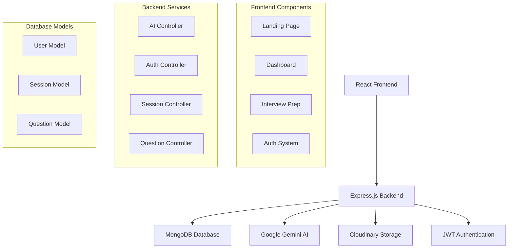

# 🚀 CareerPrep AI

<div align="center">
  
  
  
  
  
  
</div>

<div align="center">
  <h3>🎯 Ace Interviews with AI-Powered Learning</h3>
  <p>A comprehensive interview preparation platform that leverages Google's Gemini AI to provide personalized, role-specific interview questions and detailed explanations.</p>
</div>

<div align="center">
  
  
  
  
</div>

---

## 📖 Table of Contents

- [✨ Features](#-features)
- [🎬 Demo](#-demo)
- [🏗️ Architecture](#️-architecture)
- [🚀 Getting Started](#-getting-started)
- [📱 Usage](#-usage)
- [🛠️ Tech Stack](#️-tech-stack)
- [📂 Project Structure](#-project-structure)
- [🔧 Configuration](#-configuration)
- [🤝 Contributing](#-contributing)
- [📄 License](#-license)

---

## ✨ Features

### 🎯 **Intelligent Role Adaptation**

- **Personalized Questions**: Generate interview questions tailored to specific roles, experience levels, and focus topics
- **Dynamic Difficulty**: AI adapts question complexity based on your experience (1+ years to senior level)
- **Industry-Specific**: Questions crafted for various tech roles (Frontend, Backend, Full-Stack, DevOps, etc.)

### 🧠 **AI-Powered Learning**

- **Google Gemini Integration**: Leverage advanced AI for generating high-quality questions and explanations
- **Deep Concept Analysis**: Get comprehensive explanations for complex technical concepts
- **Code Examples**: Interactive code snippets and algorithmic breakdowns included in answers

### 📊 **Progressive Learning Architecture**

- **Structured Sessions**: Organize your preparation into focused interview sessions
- **Expandable Answers**: Click to reveal detailed answers for each question
- **Load More Questions**: Dynamically generate additional questions as you progress

### 🎨 **Strategic Knowledge Management**

- **Pin Important Questions**: Bookmark critical questions for quick review
- **Session Management**: Create, edit, and delete interview preparation sessions
- **Cross-Device Sync**: Access your sessions from any device with cloud storage

### 🔐 **Secure User Experience**

- **JWT Authentication**: Secure login and registration system
- **Profile Management**: Upload profile pictures with Cloudinary integration
- **Protected Routes**: Secure access to personal interview sessions

### 🎭 **Modern UI/UX**

- **Responsive Design**: Seamless experience across desktop, tablet, and mobile
- **Animated Components**: Smooth transitions and engaging interactions with Framer Motion
- **Beautiful Gradients**: Modern design with animated gradient text and highlights
- **Dark/Light Mode**: Optimized for both light and dark viewing preferences

---

## 🎬 Demo

### 🏠 Landing Page

- **Hero Section**: Compelling introduction with animated gradient text
- **Feature Showcase**: Detailed explanation of platform capabilities
- **Testimonials**: Animated marquee with user success stories
- **Interactive Highlights**: Dynamic text highlighting with various animation effects

### 📊 Dashboard

- **Session Overview**: Grid layout of all your interview preparation sessions
- **Quick Stats**: Role, experience level, question count, and last updated info
- **Session Management**: Create new sessions, delete existing ones
- **Beautiful Cards**: Gradient backgrounds with hover effects

### 💡 Interview Prep Interface

- **Question Cards**: Expandable cards with questions and detailed answers
- **Learn More Feature**: AI-powered deep explanations in a slide-out drawer
- **Pin System**: Mark important questions for future reference
- **Load More**: Infinite scroll with smooth animations

---

## 🏗️ Architecture



---

## 🚀 Getting Started

### Prerequisites

Before you begin, ensure you have the following installed:

- **Node.js** (v16.0.0 or higher)
- **npm** or **yarn**
- **MongoDB** (local installation or MongoDB Atlas)
- **Git**

### Environment Variables

Create `.env` files in both frontend and backend directories:

#### Backend (.env)

```bash
# Database
MONGODB_URI=your_mongodb_connection_string

# JWT Secret
JWT_SECRET=your_super_secret_jwt_key

# Google AI
GOOGLE_GENAI_API_KEY=your_google_gemini_api_key

# Cloudinary (for image uploads)
CLOUDINARY_CLOUD_NAME=your_cloudinary_cloud_name
CLOUDINARY_API_KEY=your_cloudinary_api_key
CLOUDINARY_API_SECRET=your_cloudinary_api_secret

# Server
PORT=5000
NODE_ENV=development
FRONTEND_URL=http://localhost:5173
```

#### Frontend (.env)

```bash
VITE_API_BASE_URL=http://localhost:5000/api
```

### Installation

1. **Clone the repository**

   ```bash
   git clone https://github.com/Lohith-11/CareerPrep-AI.git
   cd CareerPrep-AI
   ```

2. **Install Backend Dependencies**

   ```bash
   cd backend
   npm install
   ```

3. **Install Frontend Dependencies**

   ```bash
   cd ../frontend/career-prep-ai
   npm install
   ```

4. **Start the Development Servers**

   **Backend (Terminal 1):**

   ```bash
   cd backend
   npm run dev
   ```

   **Frontend (Terminal 2):**

   ```bash
   cd frontend/career-prep-ai
   npm run dev
   ```

5. **Access the Application**
   - Frontend: `http://localhost:5173`
   - Backend API: `http://localhost:5000`

---

## 📱 Usage

### 🔐 **Getting Started**

1. **Sign Up/Login**: Create an account or login to access personalized features
2. **Profile Setup**: Upload a profile picture and complete your profile

### 📝 **Creating Interview Sessions**

1. Click the **"+"** button on the dashboard
2. Fill in your target role (e.g., "Frontend Developer")
3. Specify years of experience
4. Add topics to focus on (e.g., "React, JavaScript, CSS")
5. Optionally add a description
6. Click **"Create Session"** to generate AI-powered questions

### 💡 **Interview Preparation**

1. **Browse Questions**: Scroll through generated questions
2. **Expand Answers**: Click questions to reveal detailed answers
3. **Learn More**: Get comprehensive explanations for complex concepts
4. **Pin Important**: Mark questions for quick future reference
5. **Load More**: Generate additional questions as needed

### 📊 **Session Management**

- **View All Sessions**: Dashboard shows all your interview sessions
- **Session Details**: View role, topics, question count, and last updated
- **Delete Sessions**: Remove sessions you no longer need
- **Resume Preparation**: Continue where you left off

---

## 🛠️ Tech Stack

### **Frontend**

- **⚛️ React 19.1.1** - Modern React with latest features
- **🎨 Tailwind CSS 4.1.12** - Utility-first CSS framework
- **🔄 React Router DOM 7.8.2** - Client-side routing
- **📡 Axios 1.11.0** - HTTP client for API requests
- **🎭 Framer Motion 12.23.12** - Animation library
- **⚡ Vite 7.1.2** - Fast build tool and dev server
- **🎯 Lucide React** - Beautiful icon library
- **📝 React Markdown** - Markdown rendering for AI responses
- **🍞 React Hot Toast** - Toast notifications
- **⏰ Moment.js** - Date formatting and manipulation

### **Backend**

- **🟢 Node.js** - JavaScript runtime
- **🚀 Express.js 5.1.0** - Web application framework
- **🍃 MongoDB & Mongoose 8.18.0** - Database and ODM
- **🤖 Google Generative AI 1.16.0** - AI integration for question generation
- **🔐 JWT & bcryptjs** - Authentication and password hashing
- **☁️ Cloudinary** - Image upload and storage
- **📁 Multer** - File upload middleware
- **🔒 CORS** - Cross-origin resource sharing

### **Development Tools**

- **📝 ESLint** - Code linting
- **🔧 Nodemon** - Development server auto-restart
- **🎨 Class Variance Authority** - CSS class management
- **🔄 Clsx & Tailwind Merge** - Conditional className utilities

---

## 📂 Project Structure

```
CareerPrep-AI/
├── 📁 backend/
│   ├── 📄 server.js                 # Express server setup
│   ├── 📄 package.json             # Backend dependencies
│   ├── 📁 config/
│   │   ├── 📄 db.js                # MongoDB connection
│   │   └── 📄 cloudinary.js        # Cloudinary configuration
│   ├── 📁 controllers/
│   │   ├── 📄 aiController.js       # AI question generation
│   │   ├── 📄 authController.js     # Authentication logic
│   │   ├── 📄 questionController.js # Question CRUD operations
│   │   └── 📄 sessionController.js  # Session management
│   ├── 📁 middlewares/
│   │   ├── 📄 authMiddleware.js     # JWT authentication middleware
│   │   └── 📄 uploadMiddleware.js   # File upload middleware
│   ├── 📁 models/
│   │   ├── 📄 User.js              # User schema
│   │   ├── 📄 Session.js           # Interview session schema
│   │   └── 📄 Question.js          # Question schema
│   ├── 📁 routes/
│   │   ├── 📄 authRoutes.js        # Authentication routes
│   │   ├── 📄 questionRoutes.js    # Question routes
│   │   └── 📄 sessionRoutes.js     # Session routes
│   └── 📁 utils/
│       └── 📄 prompts.js           # AI prompt templates
│
└── 📁 frontend/career-prep-ai/
    ├── 📄 package.json             # Frontend dependencies
    ├── 📄 vite.config.js          # Vite configuration
    ├── 📄 tailwind.config.js      # Tailwind CSS configuration
    ├── 📁 src/
    │   ├── 📄 App.jsx             # Main App component
    │   ├── 📄 main.jsx            # React entry point
    │   ├── 📄 index.css           # Global styles
    │   ├── 📁 pages/
    │   │   ├── 📄 LandingPage.jsx    # Home page
    │   │   ├── 📁 Auth/
    │   │   │   ├── 📄 Login.jsx      # Login component
    │   │   │   └── 📄 SignUp.jsx     # Registration component
    │   │   ├── 📁 Home/
    │   │   │   ├── 📄 Dashboard.jsx         # User dashboard
    │   │   │   └── 📄 CreateSessionForm.jsx # Session creation form
    │   │   └── 📁 InterviewPrep/
    │   │       ├── 📄 InterviewPrep.jsx     # Main interview interface
    │   │       └── 📁 components/
    │   │           ├── 📄 AIResponsePreview.jsx  # AI response renderer
    │   │           └── 📄 RoleInfoHeader.jsx     # Session info header
    │   ├── 📁 components/
    │   │   ├── 📄 Modal.jsx           # Reusable modal component
    │   │   ├── 📄 Drawer.jsx          # Slide-out drawer
    │   │   ├── 📁 Cards/
    │   │   │   ├── 📄 QuestionCard.jsx      # Individual question card
    │   │   │   ├── 📄 SummaryCard.jsx       # Session summary card
    │   │   │   └── 📄 ProfileInfoCard.jsx   # User profile card
    │   │   ├── 📁 layouts/
    │   │   │   ├── 📄 DashboardLayout.jsx   # Dashboard layout wrapper
    │   │   │   └── 📄 Navbar.jsx            # Navigation component
    │   │   └── 📁 magicui/              # Animated UI components
    │   │       ├── 📄 animated-gradient-text.jsx
    │   │       ├── 📄 Highlighter.jsx
    │   │       └── 📄 marquee.jsx
    │   ├── 📁 context/
    │   │   ├── 📄 userContext.jsx        # User state management
    │   │   └── 📄 userContextDefinition.js
    │   └── 📁 utils/
    │       ├── 📄 apiPaths.js          # API endpoint definitions
    │       ├── 📄 axiosInstance.js     # Configured Axios instance
    │       ├── 📄 data.js              # Static data and constants
    │       └── 📄 helper.js            # Utility functions
    └── 📁 public/
        └── 📄 vite.svg               # Vite logo
```

---

## 🔧 Configuration

### 🔑 **API Keys Setup**

1. **Google Gemini AI API**

   - Visit [Google AI Studio](https://aistudio.google.com/)
   - Create a new API key
   - Add to backend `.env` as `GOOGLE_GENAI_API_KEY`

2. **MongoDB Setup**

   - Use [MongoDB Atlas](https://cloud.mongodb.com/) for cloud database
   - Or install MongoDB locally
   - Add connection string to `MONGODB_URI`

3. **Cloudinary Setup**
   - Create account at [Cloudinary](https://cloudinary.com/)
   - Get cloud name, API key, and API secret
   - Add to backend `.env`

### 🚀 **Deployment**

#### **Frontend (Vercel)**

```bash
# Build the frontend
cd frontend/career-prep-ai
npm run build

# Deploy to Vercel
vercel --prod
```

#### **Backend (Railway/Heroku)**

```bash
# Add to backend package.json
{
  "scripts": {
    "start": "node server.js",
    "build": "npm install"
  }
}
```

---

## 🤝 Contributing

We welcome contributions to CareerPrep AI! Here's how you can help:

### 🐛 **Bug Reports**

- Use the [issue tracker](https://github.com/Lohith-11/CareerPrep-AI/issues)
- Include steps to reproduce
- Provide screenshots if applicable

### 💡 **Feature Requests**

- Check existing issues first
- Describe the feature clearly
- Explain the use case

### 🔧 **Development Setup**

1. Fork the repository
2. Create a feature branch: `git checkout -b feature/amazing-feature`
3. Make your changes
4. Test thoroughly
5. Commit: `git commit -m 'Add amazing feature'`
6. Push: `git push origin feature/amazing-feature`
7. Open a Pull Request

### 📋 **Contribution Guidelines**

- Follow existing code style
- Add comments for complex logic
- Update documentation if needed
- Ensure all tests pass

---

## 📄 License

This project is licensed under the **ISC License** - see the [LICENSE](LICENSE) file for details.

---

## 🙏 Acknowledgments

- **Google Gemini AI** for powerful AI capabilities
- **React Team** for the amazing framework
- **Tailwind CSS** for beautiful styling utilities
- **Framer Motion** for smooth animations
- **MongoDB** for reliable data storage
- **Cloudinary** for image management

---

## 📧 Contact

**Lohith** - [@Lohith-11](https://github.com/Lohith-11)

**Project Link:** [https://github.com/Lohith-11/CareerPrep-AI](https://github.com/Lohith-11/CareerPrep-AI)

---

<div align="center">
  <h3>⭐ If you found this project helpful, please give it a star! ⭐</h3>
  <p>Made with ❤️ by the CareerPrep Team</p>
</div>
